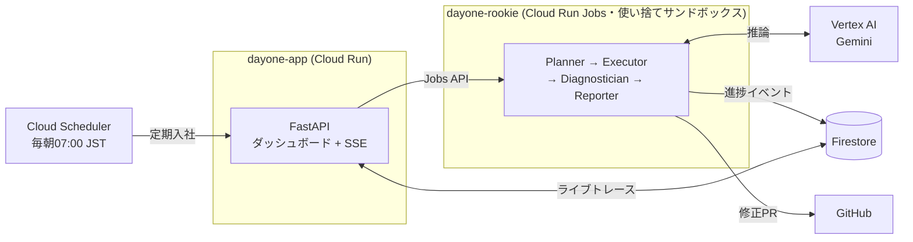

# ☀️ DayOne — 毎日が、入社初日。

**AIの新入社員が毎朝あなたのリポジトリに入社し、ドキュメント通りにセットアップを実行して、腐った手順を検知 → 自力で正しい手順を探索 → 修正PRを提出する。**

ドキュメントを「読む対象」から「毎日テストされる実行可能な成果物」に変える、Docs-as-Code の文字通りの実装です。

- 🌐 **動作デモ**: https://dayone-app-d2fceukfiq-an.a.run.app
- 🎬 **デモ動画**: https://www.youtube.com/watch?v=jgMJn3lnd2s
- 📖 **ProtoPedia**: https://protopedia.net/prototype/8711
- 🏆 DevOps × AI Agent Hackathon 2026 提出作品

## 解決したい課題

README やセットアップ手順は、**書いた瞬間から腐り始めます**。スクリプトの改名、環境変数の変更、暗黙の前提——変更のたびにドキュメントは現実からズレていき、それに気づくのは数ヶ月後に入った新人が半日を溶かした時です。

- 既存のドキュメントツールは「生成」「検索」止まりで、**書かれた手順が今日も本当に動くかは誰も検証していない**
- コードには CI があるのに、ドキュメントにはない

## 想定ユーザー

- オンボーディングのたびに「READMEが古い」問題を踏む開発チーム
- OSS メンテナ（コントリビュータの初回体験がプロジェクトの生命線）
- ドキュメント整備に人手を割けない小規模チーム

## DayOne がやること（エージェントの自律ループ）

毎朝 Cloud Scheduler が「AIルーキー」を出社させます。人間はチャットで指示すらしません。

```
出社（clone） → 読解（README→実行計画） → 実務（1ステップずつ実行）
   → 診断（失敗を3分類: ドキュメント腐敗 / 前提の記載漏れ / コード起因）
   → 自己修復（リポジトリを探索して動く手順を発見 → 再実行で検証）
   → 日報（腐敗スコア算出・摩擦レポート・ドキュメント修正PR）
```

エージェントは**計画・実行・診断・修復・検証・報告のすべてを自律判断**で行います。修正PRのマージだけが人間の仕事です（Human-in-the-Loop）。

### 独自の定量指標

| 指標 | 意味 |
|---|---|
| **ドキュメント腐敗スコア** (0-100) | 検知した摩擦の数×深刻度。ダッシュボードで推移を可視化 |
| **Time to First Success** | ゼロから環境構築が成功するまでの実測秒数 |

実測例: デモリポジトリで腐敗スコア 15 を検知、TTFS 28秒（腐敗診断・自己修復込み）。

## アーキテクチャ



| 技術 | 用途 |
|---|---|
| **Cloud Run** | ダッシュボード（公開URL） |
| **Cloud Run Jobs** | 1回の入社 = 1つの使い捨てサンドボックスコンテナ |
| **Vertex AI Gemini** (gemini-3.5-flash / 3.1-flash-lite) | 計画立案・失敗診断・修復探索・報告生成 |
| **Firestore** | 実行イベントストリーム・腐敗スコア履歴 |
| **Cloud Scheduler** | 毎朝の自律実行（チャットUI不要のエージェント） |
| **GitHub Actions** | CI/CD（Workload Identity Federationでキーレス）+ 毎日のE2E回帰 |

## セキュリティ設計（実運用への配慮）

サンドボックスで任意のセットアップコマンドを実行するため、封じ込めを最優先に設計しています。

- **最小権限サービスアカウント**: rookie は Vertex AI 呼び出しと自分の Firestore 書き込みのみ。実行環境には本番資格情報ゼロ
- **環境変数スクラブ**: 実行する子プロセスには許可リスト方式でスクラブ済み環境変数のみを渡す（`*TOKEN*` / `*KEY*` / `*SECRET*` 等は構造的に到達不能）
- **暴走封じ込め**: ステップ予算30 / アクション予算60 / ステップ120秒・Job全体10分のタイムアウト / 同一コマンド反復のループ検知
- **GitHub は fine-grained PAT**（対象リポジトリ限定・Contents/PR権限のみ、Secret Manager 管理）
- **Human-in-the-Loop**: PR のマージ判断は人間に残す

## DevOps 実践（つくる・まわす・とどける）

- **つくる**: 上記の自律エージェント本体（47件のユニットテストで挙動を固定）
- **まわす**: push → テスト → イメージビルド → Cloud Run/Jobs 自動デプロイ（GitHub Actions + WIF）。さらに**毎朝のE2E回帰がエージェント自身の品質を継続検証**（腐敗を検知できなくなったらCIが赤くなる）— エージェントを「作って終わり」にしないための仕組み
- **とどける**: 誰でも触れる公開URL。トリガーはクールダウン付きで公開デモとして安全に運用

## 実在OSSでの実行例（デモ用リポジトリ以外でも動く）

| リポジトリ | 結果 | TTFS | 判定 |
|---|---|---|---|
| [chalk/chalk](https://github.com/chalk/chalk)（週2億DL） | 腐敗スコア **0** | 84秒 | 健全なドキュメントを健全と判定（誤検知なし） |
| [fastapi/fastapi](https://github.com/fastapi/fastapi) | 腐敗スコア **0** | 17秒 | 同上 |
| [dayone-demo-py](https://github.com/1729kent/dayone-demo-py)（腐敗注入） | 腐敗スコア **15** | — | 前提記載漏れを検知し[修正PR](https://github.com/1729kent/dayone-demo-py/pull/1)を自動作成 |

実OSSテストは実装の穴も3つ暴いた（`readme.md`小文字対応・重い依存インストールのタイムアウト・診断LLMの誤帰属）。いずれも修正済みで、この「実環境で殴られて直す」ループ自体がDayOneの開発プロセスだった。

## 動かし方

### デモを見る

1. https://dayone-app-d2fceukfiq-an.a.run.app を開く
2. 「🌅 今日のルーキーを入社させる」を押す
3. 業務日誌にライブで思考と実行が流れ、約30秒で腐敗スコアと修正PRが出る

デモ用リポジトリ（腐敗を注入済み・`inject-rot.sh`/`heal.sh`で再現可能）:
[dayone-demo-node](https://github.com/1729kent/dayone-demo-node)（スクリプト改名） /
[dayone-demo-py](https://github.com/1729kent/dayone-demo-py)（前提手順の記載漏れ）

### 自分の環境に立てる

```bash
git clone https://github.com/1729kent/dayone && cd dayone
bash scripts/setup_gcp.sh              # プロジェクト・API・SA・Firestore
uv sync && uv run pytest               # テスト
# デプロイ（詳細は docs/superpowers/plans/ の実装プラン参照）
docker buildx build --platform linux/amd64 -f Dockerfile.app -t $AR/app:dev --push .
gcloud run deploy dayone-app --image $AR/app:dev --region asia-northeast1 --no-invoker-iam-check
```

ローカルUI確認: `uv run python scripts/dev_server.py 8123`（シードデータ入り）

> ℹ️ この README 自体も DayOne の毎日の E2E 回帰で検証されています。

## リポジトリ構成

```
src/dayone/
├── common/   # Settings / Pydanticモデル / Store(Firestore・Memory) / LLMラッパ
├── rookie/   # エージェント本体: planner / executor / diagnostician / reporter / sandbox
└── app/      # FastAPI ダッシュボード + Cloud Run Jobs ランチャー
tests/        # 47 unit tests（LLMはフェイク注入で決定的にテスト）
scripts/      # GCP/WIFセットアップ・E2E回帰・開発サーバー
.github/      # deploy.yml（CI/CD）+ e2e.yml（毎日の品質回帰）
```

## ライセンス / 作者

MIT — [@1729kent](https://github.com/1729kent)（DevOps × AI Agent Hackathon 2026 個人参加作品）
