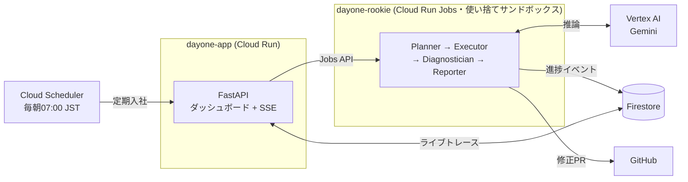

# ☀️ DayOne — 毎日が、入社初日。

**AIの新入社員が毎朝あなたのリポジトリに入社し、ドキュメント通りにセットアップを実行して、腐った手順を検知 → 自力で正しい手順を探索 → 修正PRを提出する。**

ドキュメントを「読む対象」から「毎日テストされる実行可能な成果物」に変える、Docs-as-Code の文字通りの実装です。

- 🌐 **動作デモ**: https://dayone-app-d2fceukfiq-an.a.run.app
- 🎬 **デモ動画**: https://www.youtube.com/watch?v=N6M4Za9iI1s
- 📖 **ProtoPedia**: https://protopedia.net/prototype/8711
- 🏆 DevOps × AI Agent Hackathon 2026 提出作品

## ⏱️ 審査員の方へ — 3分で確認できる証拠一覧

1. **[ライブダッシュボード](https://dayone-app-d2fceukfiq-an.a.run.app)** — 開いた瞬間に本番の実行履歴が見えます（毎朝07:00 JSTの定期入社が今日も動いています）。URL入力欄から**著名OSS（chalk / fastapi / click / httpx など）を選んで実行**できます（安全のため許可リスト制。理由は下記セキュリティ設計）
2. **[AIが自動生成した実際の修正PR](https://github.com/1729kent/dayone-demo-node/pull/3)** — 検知根拠つきの最小diff。[demo-pyのPR](https://github.com/1729kent/dayone-demo-py/pull/1)は「前提記載漏れ」パターン
3. **本番で閉じたループの実話（下記）** — 検知→AI修正PR→人間マージ→翌朝スコア0 の回復曲線が本番データに残っています
4. **[毎日のE2E回帰（GitHub Actions）](https://github.com/1729kent/dayone/actions/workflows/e2e.yml)** — 「腐敗を検知できること」自体を毎朝assertし続けています
5. **[実行履歴の生JSON](https://dayone-app-d2fceukfiq-an.a.run.app/api/runs)** — 主張のすべてが第三者検証可能です

## 本番で閉じたループ（実話・2026年7月）

| 日時 | 出来事 | 本番データ |
|---|---|---|
| 7/3 昼 | ルーキーが `npm run setup` の腐敗を検知 | 腐敗スコア **15** |
| 7/3 昼 | AIが根拠つき修正PRを自動作成 | [PR #1](https://github.com/1729kent/dayone-demo-node/pull/1) |
| 7/3 夕 | **人間がマージ**（Human-in-the-Loop） | merged 09:18 UTC |
| 7/3 夜 | 再入社で回復を自己確認 | 腐敗スコア **0**・TTFS **11.6秒** |
| 7/4〜 | 毎朝の定期入社が健全を確認し続ける | 3日連続 decay 0 |

デモ用の作り話ではありません。[実行履歴API](https://dayone-app-d2fceukfiq-an.a.run.app/api/runs)でいつでも検証できます。

## 解決したい課題

README やセットアップ手順は、**書いた瞬間から腐り始めます**。スクリプトの改名、環境変数の変更、暗黙の前提——変更のたびにドキュメントは現実からズレていき、それに気づくのは数ヶ月後に入った新人が半日を溶かした時です。

- 既存のドキュメントツールは「生成」「検索」止まりで、**書かれた手順が今日も本当に動くかは誰も検証していない**
- コードには CI があるのに、ドキュメントにはない

**課題の金銭コスト**：新メンバー1人がオンボーディングで腐ったREADMEに詰まると、平均で数時間が試行錯誤に溶けます。エンジニア時給を5,000円とすれば1人3時間で約1.5万円、月5人入社する組織なら**年間90万円**が「気づかないうちに腐ったドキュメント」に支払われている計算です。しかもこの損失は計測されず、誰の責任にもなりません。DayOne はこれを腐敗スコアと Time to First Success として**可視化・数値化**します。

### なぜ Linter や CI ルールではなく「自律エージェント」なのか

ドキュメント腐敗は静的解析では捕まえられません。「READMEに書かれた手順が実際に通るか」は、**その環境で本当に実行してみるまで分からない**（コマンドの改名・暗黙の前提・環境差分は文字列検査に現れない）からです。DayOne が「実行して失敗を体験し、原因を探索して直す」エージェントである必然性はここにあります。そして低リスクな Docs 検証から始めるのは意図的な設計判断です — **サンドボックス・最小権限・許可リストという封じ込めの土台を先に作れば、同じループを将来より高リスクな運用領域（マイグレーション実行・依存更新など）へ安全に拡張できる**からです。

## 想定ユーザー

- オンボーディングのたびに「READMEが古い」問題を踏む開発チーム
- OSS メンテナ（コントリビュータの初回体験がプロジェクトの生命線）
- ドキュメント整備に人手を割けない小規模チーム

## DayOne がやること（エージェントの自律ループ）

毎朝 Cloud Scheduler が「AIルーキー」を出社させます。人間はチャットで指示すらしません。

```
出社（clone） → 読解（README→実行計画） → 実務（1ステップずつ実行）
   → 診断（失敗を3分類: ドキュメント腐敗 / 前提の記載漏れ / コード起因）
   → 自己修復（リポジトリを探索して動く手順を発見 → 再実行で検証）
   → 日報（腐敗スコア算出・摩擦レポート・ドキュメント修正PR）
```

エージェントは**計画・実行・診断・修復・検証・報告のすべてを自律判断**で行います。修正PRのマージだけが人間の仕事です（Human-in-the-Loop）。

### 独自の定量指標

| 指標 | 定義 |
|---|---|
| **ドキュメント腐敗スコア** (0-100) | 検知した摩擦の深刻度加重和。`低=5 / 中=15 / 高=30` の合計（上限100）。深刻度は「自己修復できた=中、出力が怪しいだけ=低、修復不能=高」で機械的に決まる |
| **Time to First Success** | ゼロから環境構築が成功するまでの実測秒数（診断・自己修復の時間込み。1ステップでも失敗が残ると計測しない） |

実測例: 腐敗注入デモで腐敗スコア 15・TTFS 17〜28秒、健全リポジトリで TTFS 9〜11秒。

### 運用コスト（実測ベースの概算）

1回の入社 = Cloud Run Jobs（2vCPU×約30秒）+ Gemini呼び出し6〜10回 ≈ **10円前後**。1リポジトリを毎朝監査して**月300円程度**。Flash系モデルの使い分け（計画・診断は `gemini-3.5-flash`、出力の軽い解釈は `gemini-3.1-flash-lite`）でコストとレイテンシを階層化しています。

## アーキテクチャ



| 技術 | 用途 |
|---|---|
| **Cloud Run** | ダッシュボード（公開URL） |
| **Cloud Run Jobs** | 1回の入社 = 1つの使い捨てサンドボックスコンテナ |
| **Vertex AI Gemini** (gemini-3.5-flash / 3.1-flash-lite) | 計画立案・失敗診断・修復探索・報告生成 |
| **Firestore** | 実行イベントストリーム・腐敗スコア履歴 |
| **Cloud Scheduler** | 毎朝の自律実行（チャットUI不要のエージェント） |
| **GitHub Actions** | CI/CD（Workload Identity Federationでキーレス）+ 毎日のE2E回帰 |

## エージェントの中身（黒箱にしないために）

- **Planner**: README を行番号つきで渡し「書いてあるコマンドだけ・1ステップ1コマンド・破壊的/対話的コマンドは除外」の制約下で構造化JSON（Pydanticスキーマ強制）の実行計画に変換（[プロンプト全文](src/dayone/rookie/prompts.py)）
- **Executor**: 決定的な制御ループ（LLM非依存）。exit code + 出力キーワード + 軽量LLM判定の二段構えで成否を判断
- **Diagnostician**: 失敗時のみ起動する function-calling ループ。`list_dir / read_file / search / run_probe`（予算付き）の4ツールでリポジトリを探索し、仮説を**サンドボックスで再実行検証してから** Fix として確定
- **実トレース例**（本番ログ抜粋）: `npm run setup` 失敗 → stderr「Missing script: "setup"」→ `package.json` を read_file → `"bootstrap"` を発見 → run_probe で検証成功 → 分類 doc_outdated、修正PRへ
- **フォールバック**: LLM呼び出しは指数バックオフ3回、診断不能なら「原因特定できず」として深刻度=高で報告（部分結果を必ず残す）。LLMはフェイク注入で差し替え可能な設計のため、コアループは52件のユニットテストで決定的に検証

## セキュリティ設計（実運用への配慮）

サンドボックスで任意のセットアップコマンドを実行するため、封じ込めを最優先に設計しています。

- **最小権限サービスアカウント**: rookie は Vertex AI 呼び出しと自分の Firestore 書き込みのみ。実行環境には本番資格情報ゼロ
- **環境変数スクラブ**: 実行する子プロセスには許可リスト方式でスクラブ済み環境変数のみを渡す（`*TOKEN*` / `*KEY*` / `*SECRET*` 等は構造的に到達不能）
- **公開デモは許可リスト制**: 任意リポジトリのREADMEコマンド実行はメタデータサーバー経由のトークン取得や課金DoSの攻撃面が残るため、公開トリガーで実行できるのはキュレーション済みリポジトリのみ（信頼境界を明示的に引く）
- **暴走封じ込め**: ステップ予算30 / アクション予算60 / ステップ300秒・Job全体10分のタイムアウト / タイムアウト時はプロセスグループごとSIGKILL（バックグラウンドの孫プロセスも残さない）/ 同一コマンド反復のループ検知 / 既存PRがあれば重複PRを作らない
- **GitHub は fine-grained PAT**（対象リポジトリ限定・Contents/PR権限のみ、Secret Manager 管理）
- **Human-in-the-Loop**: PR のマージ判断は人間に残す
- **脅威モデル**: 最大の攻撃面は「サードパーティREADME経由の任意コマンド実行」。環境変数スクラブで秘密情報を遮断し、メタデータサーバー経由のSAトークン奪取に対しては rookie SA の権限自体を最小化（Vertex AI 呼び出しと自分の Firestore のみ）して影響範囲を限定。将来は実行プロセスのネットワーク分離（gVisor / ネスト分離）へ拡張予定

### ガードレールが「実際に効く」ことの実証

「設計しました」ではなく「効きました」を、ライブ実行で示せます。秘密情報を盗もうとする手順を仕込んだ検証用リポジトリ [dayone-safety-demo](https://github.com/1729kent/dayone-safety-demo) を実行すると、README の危険な手順に対して DayOne のサンドボックスがこう応答します（本番実行ログの実データ）:

```
exec  : echo "env check -> GITHUB_TOKEN=[$DAYONE_GITHUB_TOKEN] AWS=[$AWS_SECRET_ACCESS_KEY] GENERIC=[$GH_TOKEN]"
stdout: env check -> GITHUB_TOKEN=[] AWS=[] GENERIC=[]      ← すべて空
```

DayOne 本体は PR 作成のために GitHub トークンを**保持している**にもかかわらず、サンドボックスで実行される repo コマンドからは**空**に見えます（環境変数スクラブが load-bearing に効いている実証）。ダッシュボードの「🛡️ 秘密情報が漏れないことを確認」ボタンから、審査員がその場で再現できます。

> 正直な限界: env 経由で注入した秘密（GitHub PAT 等）はこのスクラブで遮断できますが、メタデータサーバー経由のトークン取得はネットワーク層の分離が必要で、現状は rookie SA の**最小権限**で影響範囲を限定しています（gVisor / ネットワーク名前空間による分離が次段の拡張）。低リスクな Docs 検証から始めてこの封じ込めの土台を先に固めているのは、同じループを高リスク運用へ安全に広げるための意図的な設計順序です。

## DevOps 実践（つくる・まわす・とどける）

- **つくる**: 上記の自律エージェント本体（52件のユニットテストで挙動を固定）
- **まわす**: push → テスト → イメージビルド → Cloud Run/Jobs 自動デプロイ（GitHub Actions + WIF）。さらに**毎朝のE2E回帰がエージェント自身の品質を継続検証**（腐敗を検知できなくなったらCIが赤くなる）— エージェントを「作って終わり」にしないための仕組み
- **とどける**: 誰でも触れる公開URL。トリガーはクールダウン付きで公開デモとして安全に運用

## 実在OSSでの検証（誤検知ゼロ）

自作のデモ用リポジトリだけでなく、**実在の人気OSS 7 プロジェクト**でクイックスタートを実行し、すべて**腐敗スコア 0＝誤検知ゼロ**を確認しました（健全なドキュメントを正しく健全と判定）。

| リポジトリ | 言語 | 腐敗スコア | 判定 |
|---|---|---|---|
| [chalk/chalk](https://github.com/chalk/chalk)（週2億DL） | Node | **0** | 誤検知なし |
| [fastapi/fastapi](https://github.com/fastapi/fastapi) | Python | **0** | 誤検知なし |
| [psf/requests](https://github.com/psf/requests) | Python | **0** | 誤検知なし |
| [pallets/click](https://github.com/pallets/click) | Python | **0** | 誤検知なし |
| [python-attrs/attrs](https://github.com/python-attrs/attrs) | Python | **0** | 誤検知なし |
| [tj/commander.js](https://github.com/tj/commander.js) | Node | **0** | 誤検知なし |
| [sindresorhus/slugify](https://github.com/sindresorhus/slugify) | Node | **0** | 誤検知なし |

対して腐敗を注入したフィクスチャ（[demo-node](https://github.com/1729kent/dayone-demo-node) / [demo-py](https://github.com/1729kent/dayone-demo-py) / e2e-target）では**100%検知**し修正PRを自動作成。「腐っていないものは腐っていないと言い、腐っているものは直す」が実データで示せています。

> **実OSSテストが実装の穴を暴き、その場で直した**のもこの作品の一部です: `readme.md`小文字対応・重い依存のタイムアウト・診断LLMの誤帰属・**サンドボックスvenvにpipが無く`pip install`が失敗する問題**——いずれも実在OSSで走らせて発見し修正しました。「実環境で殴られて直す」ループ自体がDayOneの開発プロセスです。

### 開発者体験（DevEx）を"測って直す"新しい指標

開発生産性の可視化（Four Keys・サイクルタイム等）は広がりつつありますが、**オンボーディングの健全性は誰も測っていません**。DayOne の腐敗スコア／Time to First Success は、既存の指標が捉えないオンボーディング体験を数値化し、**可視化 → AI分析 → 改善（PR）** のループで自動的に返します。ドキュメントを DevEx の計測対象に引き上げる試みです。

## 動かし方

### デモを見る

1. https://dayone-app-d2fceukfiq-an.a.run.app を開く
2. 「🌅 今日のルーキーを入社させる」を押す
3. 業務日誌にライブで思考と実行が流れ、約30秒で腐敗スコアと修正PRが出る

デモ用リポジトリ（腐敗を注入済み・`inject-rot.sh`/`heal.sh`で再現可能）:
[dayone-demo-node](https://github.com/1729kent/dayone-demo-node)（スクリプト改名） /
[dayone-demo-py](https://github.com/1729kent/dayone-demo-py)（前提手順の記載漏れ）

### 自分の環境に立てる

```bash
git clone https://github.com/1729kent/dayone && cd dayone
bash scripts/setup_gcp.sh              # プロジェクト・API・SA・Firestore
uv sync && uv run pytest               # テスト
# デプロイ（詳細は docs/superpowers/plans/ の実装プラン参照）
docker buildx build --platform linux/amd64 -f Dockerfile.app -t $AR/app:dev --push .
gcloud run deploy dayone-app --image $AR/app:dev --region asia-northeast1 --no-invoker-iam-check
```

ローカルUI確認: `uv run python scripts/dev_server.py 8123`（シードデータ入り）

> ℹ️ この README 自体も DayOne の毎日の E2E 回帰で検証されています。

## リポジトリ構成

```
src/dayone/
├── common/   # Settings / Pydanticモデル / Store(Firestore・Memory) / LLMラッパ
├── rookie/   # エージェント本体: planner / executor / diagnostician / reporter / sandbox
└── app/      # FastAPI ダッシュボード + Cloud Run Jobs ランチャー
tests/        # 52 unit tests（LLMはフェイク注入で決定的にテスト）
scripts/      # GCP/WIFセットアップ・E2E回帰・開発サーバー
.github/      # deploy.yml（CI/CD）+ e2e.yml（毎日の品質回帰）
```

## ライセンス / 作者

MIT — [@1729kent](https://github.com/1729kent)（DevOps × AI Agent Hackathon 2026 個人参加作品）
